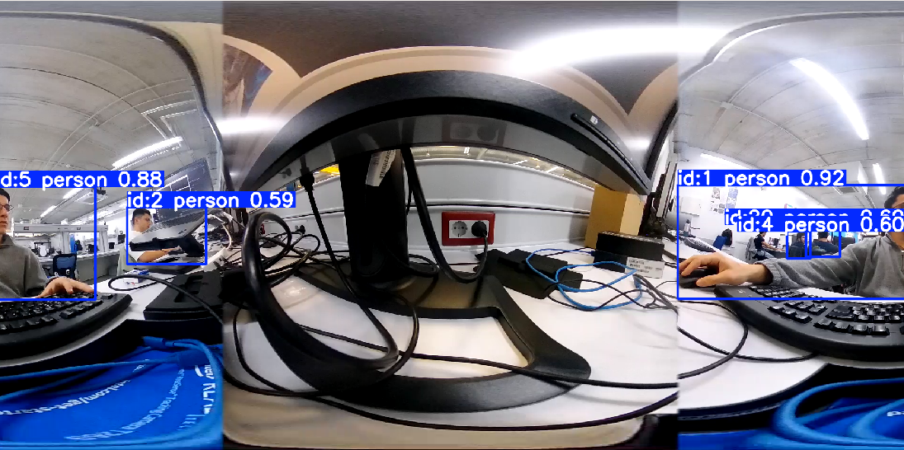
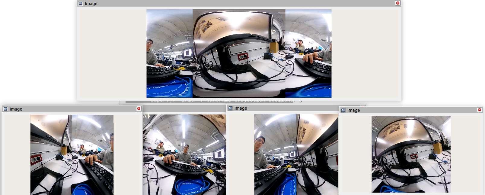
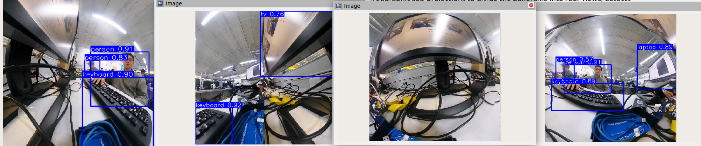
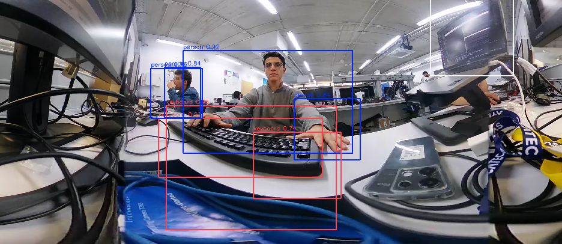
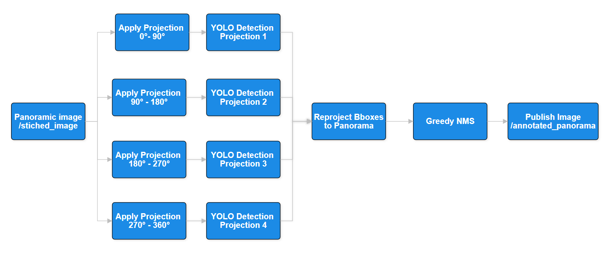

# tracker\_360: 360° Panorama Object Detection Node for ROS 2

## Overview

`tracker_360` is a ROS 2 package that enables real-time object detection on 360° equirectangular panorama images. It uses stereographic sub-projections to divide the panorama into four views, detects objects individually, and reprojects the detections onto the panorama.

This package has been specifically designed to solve the common problem of **duplicate detections** at the horizontal seams of 360° images. Objects crossing the 0°/360° boundary — such as people partially visible on each side of the panorama — can often be detected twice. Our method uses custom reprojection and merging logic to robustly **unify duplicated detections**, as illustrated below.

<p align="center">

</p>

This implementation is inspired by the paper:

> Wenyan Yang, Yanlin Qian, Joni-Kristian Kämäräinen, "Object Detection in Equirectangular Panorama," CVPR Workshops, 2018.

## Installation

### 1. System Prerequisites

```bash
sudo apt update
sudo apt install -y \
  python3-colcon-common-extensions \
  ros-humble-cv-bridge \
  libopencv-dev \
  libgstreamer1.0-dev \
  libgstreamer-plugins-base1.0-dev \
  libgstreamer-plugins-bad1.0-dev \
  libglib2.0-dev \
  libusb-1.0-0-dev
```

### 2. Python Dependencies

```bash
pip3 install --user \
  ultralytics \
  opencv-python \
  numpy \
  torch torchvision
```

### 3. Clone & Build

```bash
cd ~/ros2_ws/src
git clone https://github.com/YourOrg/tracker_360.git
cd ~/ros2_ws
colcon build --packages-select tracker_360
source install/setup.bash
```

## Detailed Workflow

### 1. Subscribe to Panorama

- Subscribes to `/stitched_image` (`sensor_msgs/Image`) containing an equirectangular 360° panorama.

### 2. Precompute LUTs (Lookup Tables)

On node initialization, four Lookup Tables (LUTs) are generated — one for each yaw angle (0°, 90°, 180°, 270°).  
Each LUT encodes how pixels in a stereographic projection view map to sampling locations in the original equirectangular panorama.

#### How LUTs are generated:

**For each yaw direction:**

- A virtual tangent plane is defined, centered on the unit sphere at the desired yaw and pitch angles.
- For every pixel (x,y) in this planar view:
  - It is mapped to a point (θ, Φ) on the sphere using the inverse stereographic projection (based on Eq. (1) from the paper).
  - (θ, Φ) represent spherical coordinates: latitude and longitude.
  - These spherical coordinates are then converted to pixel coordinates in the panorama using:

  \[
  u = W \cdot \frac{\phi}{2\pi}, \quad
  v = H \cdot \frac{\theta}{\pi}
  \]

  where W and H are the panorama width and height.

- The resulting (u, v) values are stored in a LUT, so that `cv2.remap()` can efficiently sample the correct pixels from the 360° panorama.

At runtime, applying `cv2.remap()` with this LUT generates a stereographic view centered at the desired yaw and pitch, with an approximate 180° horizontal Field of View (FOV).

Neighboring projections are spaced 90° apart to ensure full coverage and generate an effective overlap of ~90° between adjacent views.

This method concentrates detection on local undistorted areas, significantly reducing the visual distortions common in raw equirectangular images, especially near horizontal seams.


### 3. Apply Projections (Parallelized)

- When a frame arrives, it is simultaneously projected into four stereographic views using the precomputed LUTs.
- Projections are computed in parallel using `ThreadPoolExecutor`.

<p align="center">
    
    </p>

### 4. YOLO Object Detection (Batch Parallelizable)

- All four stereographic projections are batched together and passed through a YOLO model.
- This batch inference improves overall GPU utilization and minimizes latency.
- Each detection outputs bounding boxes (center x, center y, width, height), confidence scores, and class IDs.

<p align="center">
    
    </p>

### 5. Reprojection of Bounding Boxes to Panorama

After detection on the stereographic projections, bounding boxes must be accurately mapped back to the original panorama.

- First, the bounding box corners (top-left and bottom-right) are rescaled relative to the stereographic view.
- These corners are inverse-mapped to spherical coordinates using `map_to_sphere`.
- Spherical coordinates are then converted to UV pixel coordinates in the panorama.
- Special logic corrects wrap-around at the 0°/360° seam to ensure correct bounding box representation.

### 6. Global NMS (Greedy Merge)

- After reprojection, bounding boxes from all projections are grouped.
- The custom greedy_merge_largest_box() algorithm is applied:
    - Detections with IoU > 0.2 are clustered together.
    - For each cluster, the box with the largest score-weighted area is kept.
This method effectively removes duplicated detections from overlapping regions and projection seams. The following image illustrates the duplication problem without applying the custom NMS:

<p align="center">
    
    </p>


### 7. Draw and Publish Annotated Image

- After selecting the final set of detections through the custom NMS, the bounding boxes are drawn onto a copy of the original panorama.

- Each detection is annotated with its class label and confidence score.

- Standard YOLO color coding is used for consistency and clarity.

- The final annotated panorama is then published on the ROS 2 topic /annotated_panorama.

<div align="center">
  
</div>

## Processing Pipeline Overview

<div align="center">
  
</div>

## ROS 2 Usage

### Run Node Directly

```bash
ros2 run tracker_360 multi_person_tracker
```

### Run with Launch File

```bash
ros2 launch tracker_360 multi_person_tracker.launch.py \
  stereo_image_size:=448x448 \
  confidence_threshold:=0.5 \
  model_path:=/path/to/yolov8n.pt
```

Launch arguments:

- `stereo_image_size`: Size of each stereographic view.
- `confidence_threshold`: Minimum score for object acceptance.
- `model_path`: Path to your YOLO model.

### Topics

| Topic Name             | Type                | Direction | Description                    |
| ---------------------- | ------------------- | --------- | ------------------------------ |
| `/stitched_image`      | `sensor_msgs/Image` | Sub       | Input panorama image           |
| `/image_projection1-4` | `sensor_msgs/Image` | Pub       | Projected views for debugging  |
| `/annotated_panorama`  | `sensor_msgs/Image` | Pub       | Final panorama with detections |

## Example Commands

```bash
# Launch the node
ros2 run tracker_360 multi_person_tracker --ros-args \
  -p stereo_image_size:="448x448" \
  -p confidence_threshold:=0.6 \
  -p model_path:="~/models/yolov8m.pt"

# Visualize the output
rqt_image_view /annotated_panorama
```

## Limitations & Future Work

- **Seam Issues**: Minor misalignment artifacts may still appear for objects split between views.
- **Inference Speed**: Planned future improvement includes ONNX+TensorRT acceleration and better inference parallelization.
- **Dynamic FOV Adjustment**: Adapting projection FOVs based on object density for better coverage.

## References

- Wenyan Yang et al., "Object Detection in Equirectangular Panorama," CVPR Workshops, 2018.
- Ultralytics YOLO: [https://github.com/ultralytics/ultralytics](https://github.com/ultralytics/ultralytics)

---

*Created by Your Name — for advanced ROS 2 perception applications.*

